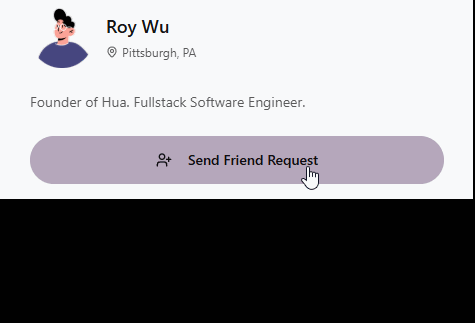

## [Hua – A Modern Social Messaging App](https://www.huachat.org/login)

Hua is a fullstack MERN application that lets users add friends, send friend requests, chat via text and video, and share images—all within a sleek and animated interface. Built for simplicity and speed, Hua connects people in real-time through a secure and intuitive platform. 

Connect with me on [huachat.org](https://www.huachat.org/login), it's free! (and always will be)

## Features
- 💬 Real-time text chat
- 📹 One-on-one video calls via Stream API
- 🖼️ Image and media sharing in chats
- 👥 Friend requests and contact management
- ✅ Modern and smooth UI made with Tailwind, DaisyUI, and Framer-Motion - with A LOT of themes!
- ⚡ Optimized data fetching with TanStack Query and axios
- 🔒 JWT-based authentication and secure login, bcrypt for encryption

## Tech Stack

### Frontend
- React
- TanStack Query (React Query)
- Tailwind CSS + DaisyUI
- Zustand (State Management)
- Axios
- Framer Motion

### Backend
- Node.js & Express
- MongoDB & Mongoose
- JWT & bcrypt for authentication
- Stream API for video & chat
- Custom RESTful API routes and middleware
